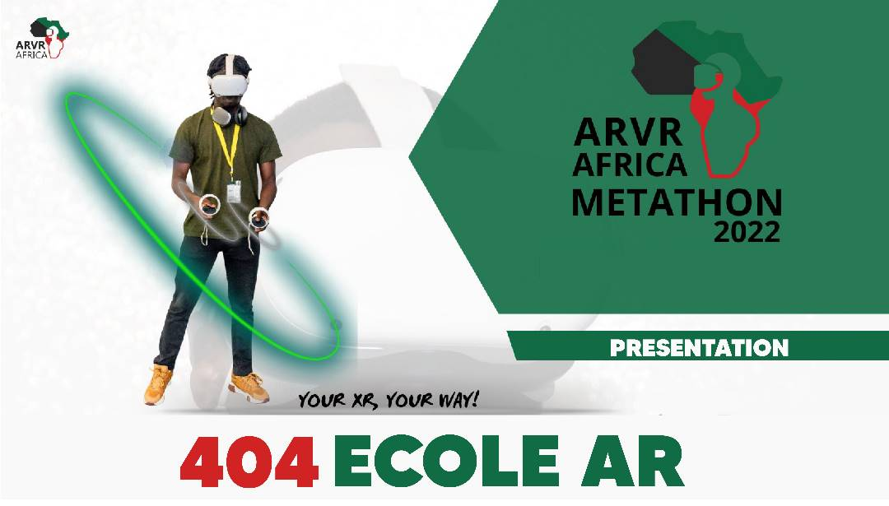

*CLiquez pour voir la démo .*

## Secteur
Education

## A propos du projet
Le projet consiste à apporter un plus au cours de conduite réel. en effet la solution permettra aux personnes d'apprendre sur le code de la route, la conduite, les bonnes pratiques routières mais aussi et surtout de simuler des conduites en immersion avec la realité augmentée. rouler dans les rues des villes et connaitre egalement ces rues. 
### Technologies utilisées

* [React.JS](https://reactjs.org/)
* [Three.JS](https://threejs.org/)

## Note
L'application Web est optimisée pour le mobile. Sur iOS, la RA ne fonctionnera qu'avec le XRViewer de Mozilla. Sur Android, l'application devra être déployée sous HTTPS.

# Lancer le projet

Dans le répertoire racine, lancez les commandes suivantes:

### `npm install` 
### `npm start`